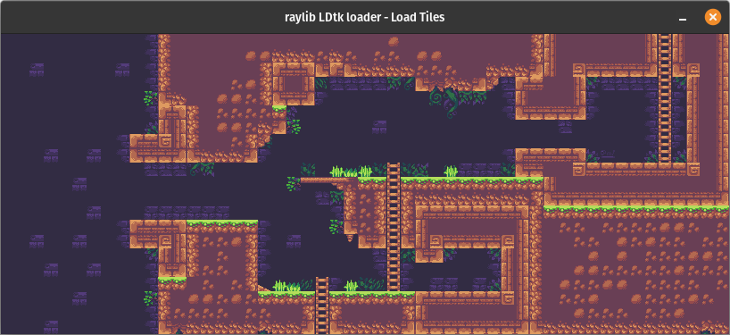

# raylib-cmake-ldtk-template

A minimal project template for a 2D game in raylib with LDtk integration that builds with CMake.



_The code example - Raylib loading tiles from LDtk!_

## Features
- `raylib` - The dependency is automatically fetched from GitHub and built by CMake using `FetchContent`.
- `cLDTK` - Support for LDtk is builtin to the project using this library.
- Asset handling - Using an `ASSETS_PATH` macro in CMake, resources can be more easily imported into Raylib without path issues.

## Usage

While visiting this repo on GitHub, select "Use this template" to create your own repository based on this template.

### Building

After cloning your repo, building follows the same workflow for any other CMake project:

```bash
mkdir build && cd build
cmake ..
make
```

Then, to run the example in the screenshot above:

```bash
./my_raylib_game
```